# Latent Energy

<div align="center">
  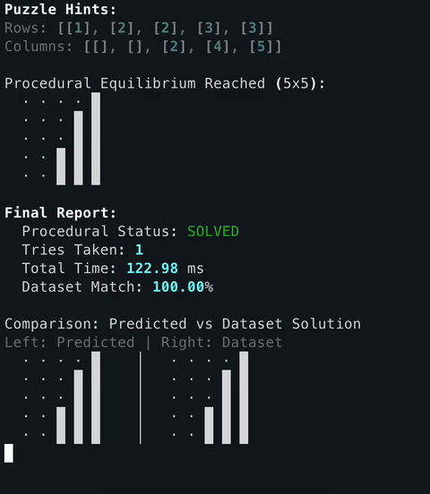
</div>

#### Kinetic resolution for logic systems using energy based models

This project implements an energy based model for solving nonogram puzzles, treating constraint satisfaction as an energy minimization problem rather than a search problem. The system learns to assign energy values to grid configurations, where lower energy corresponds to more likely solutions, and then uses gradient based optimization to find the minimum energy state that satisfies all constraints.

## The technical approach

We use a convolutional neural network architecture to model the energy function, combined with explicit logical constraints in the energy formulation. The training process involves both supervised pre training and self supervised contrastive learning.

### Core components

| Component | Implementation | Purpose |
|-----------|----------------|---------|
| Energy function | NonogramCNN with 4 Conv2d layers| Maps grid+hints to scalar energy |
| Logic encoding | Row/col hint processing | Incorporates puzzle constraints |
| Kinetic solver | Gradient descent with noise | Navigates energy landscape |
| Training pipeline | Two phase hybrid | Combines supervised+EBM learning |

## Energy function

The energy function combines three components:

```
E_total = E_neural + E_logic + E_binary
```

### Neural energy

A convolutional neural network processes the 5x5 grid and hints. The grid is treated as a single channel, with hints encoded as additional channels. The CNN uses convolutional layers with 256 channels each, followed by a final projection to scalar energy.

### Logic energy

This enforces row and column constraints:

```
E_logic = MSE(row_sums, hint_row_sums) + MSE(col_sums, hint_col_sums)
```

### Binary energy

Encourages solutions to be near 0 or 1 values:

```
E_binary = mean(grid²)
```

## Data pipeline

The system uses a three layer medallion architecture:

```
Bronze: Raw parquet files from Hugging Face
Silver: Processed puzzles with normalized schemas
Gold: Tensor representations for training
```

Each puzzle is encoded as:
- Grid: 5x5 binary matrix
- Row hints: 5x2 tensor (max 2 hints per row)
- Column hints: 5x2 tensor (max 2 hints per column)

### Data Visualizations

For the processed data, we generate visualizations for at-a-glance verification

<table>
    <tr> <td> <p align="center"><b>Summary Metrics</b></p> 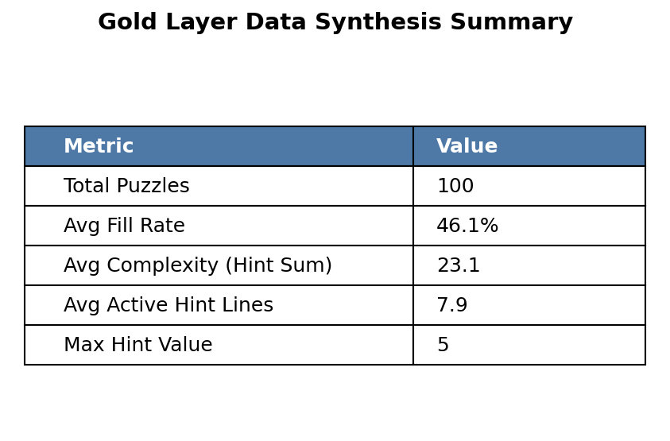 </td> <td> <p align="center"><b>Silver Complexity vs Size</b></p> 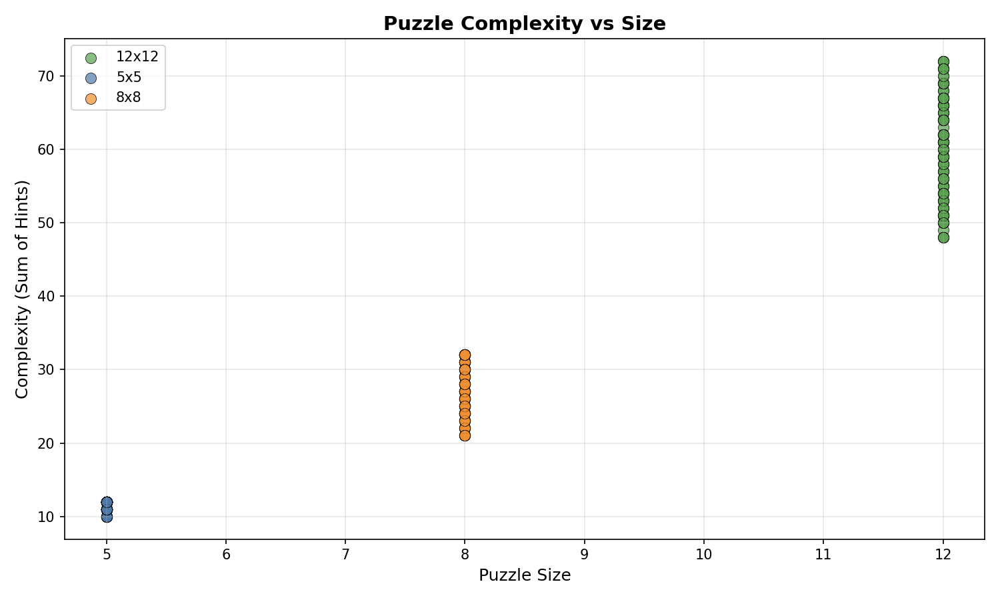 </td> </tr> <tr> <td> <p align="center"><b>Silver Size Distribution</b></p>  </td> <td> <p align="center"><b>5x5 Complexity Atlas</b></p> 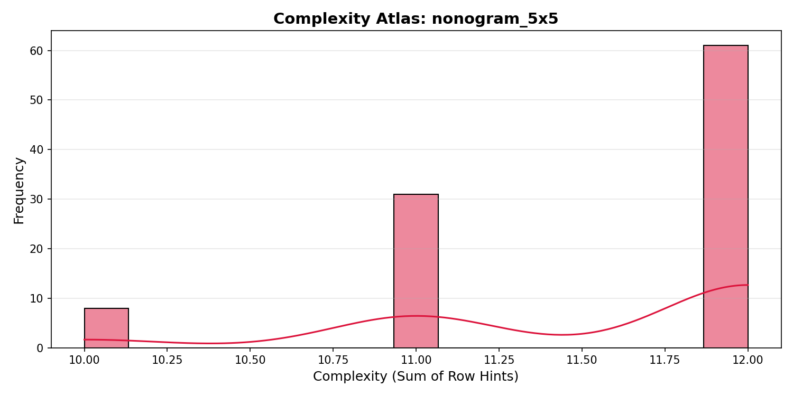 </td>
    </tr>
    <tr> <td width="50%"> <p align="center"><b>Complexity Density</b></p> 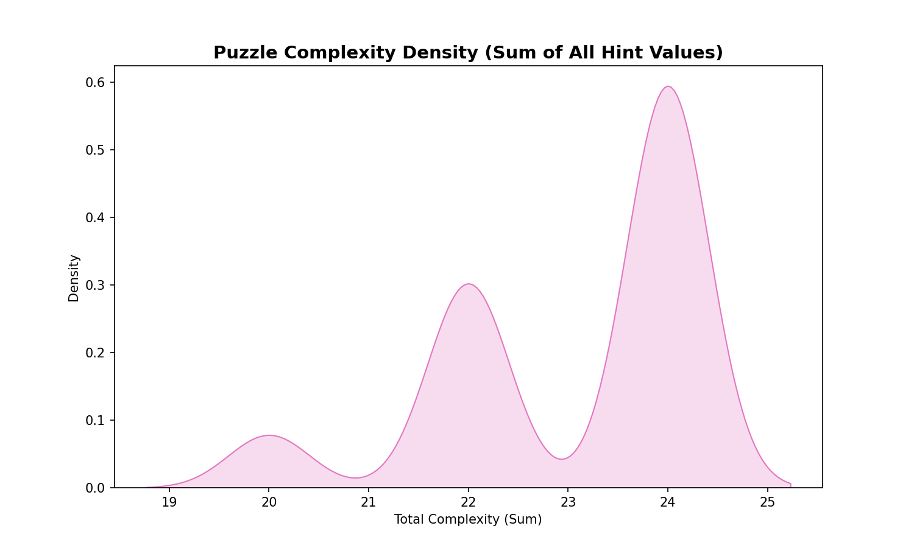 </td> <td width="50%"> <p align="center"><b>Hint Count Distribution</b></p> 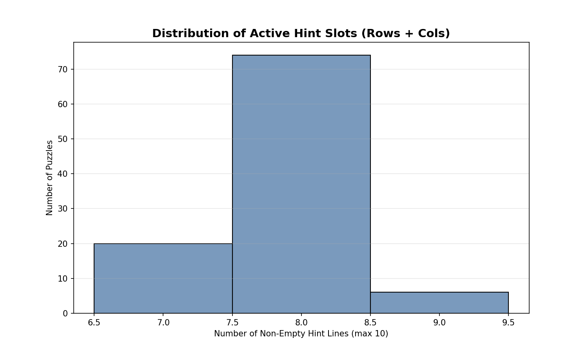 </td> </tr> <tr> <td> <p align="center"><b>Hint Value Frequency</b></p> 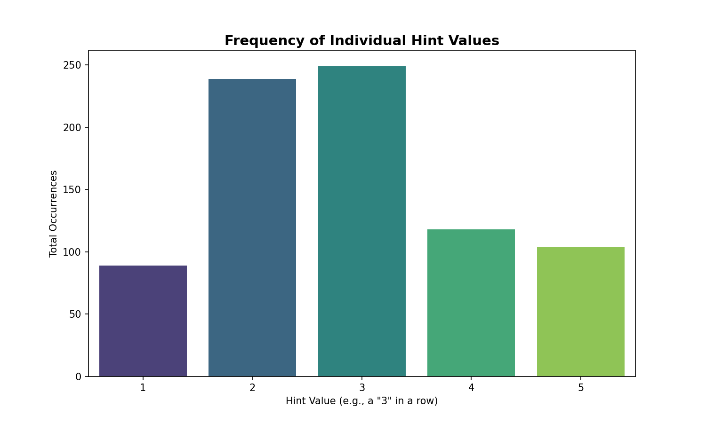 </td> <td> <p align="center"><b>Occupancy Heatmap</b></p>  </td> </tr> 

 </table>

## Training

A two phases approach.

### Supervised pre training

The model first learns direct mapping from hints to solutions using mean squared error loss. This provides a strong head start for the energy based learning phase.

Parameters:
- Learning rate: 1e-3
- Batch size: 16
- Epochs: 15
- Loss: MSE between predicted and target grids

### Energy based training

The model learns to distinguish good solutions from bad ones through contrastive learning. We compare real solutions against random noise and perturbed solutions.

Contrastive loss:
```
loss = max(0, E_solution - E_noise + margin) + 
       max(0, E_solution - E_perturbed + margin)
```

Parameters:
- Learning rate: 1e-4
- Energy margin: 2.0
- Noise scale: 0.3
- Perturbation probability: 0.2


### Model Visualizations

<table>
  <tr>
    <td width="50%">
      <p align="center"><b>Gradient Field Overview</b></p>
      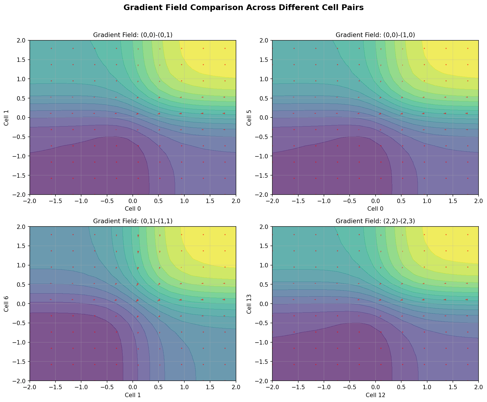
    </td>
    <td width="50%">
      <p align="center"><b>Cell Neighborhood Map</b></p>
      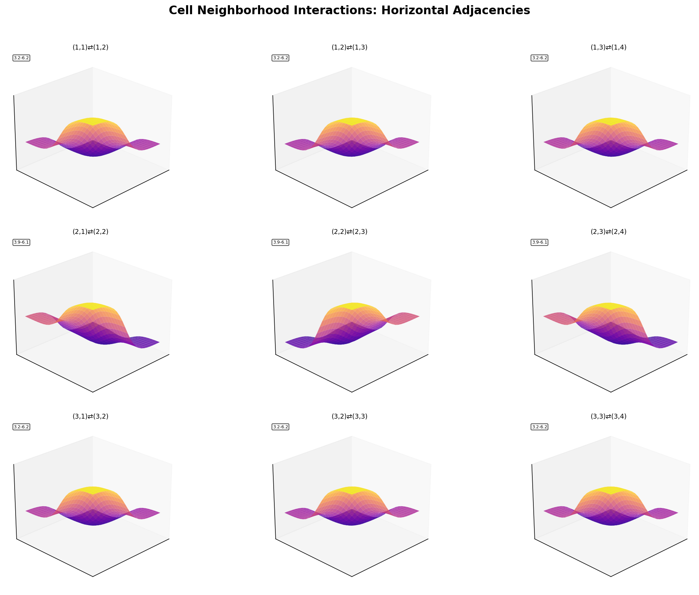
    </td>
  </tr>

  <tr>
    <td width="50%">
      <p align="center"><b>Energy Atlas (3x3 Detail)</b></p>
      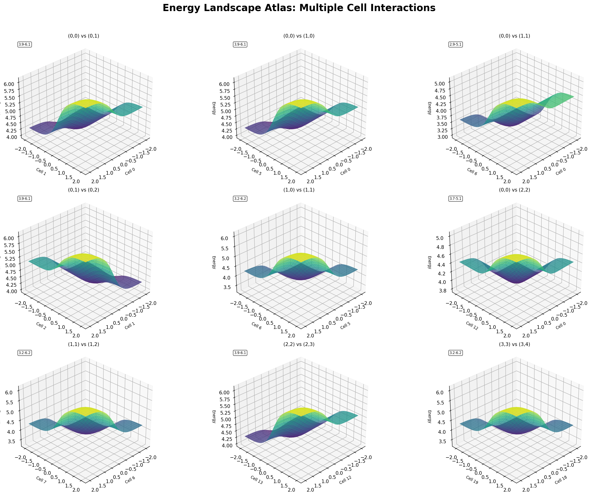
    </td>
    <td width="50%">
      <p align="center"><b>Cell Occupancy Heatmap</b></p>
      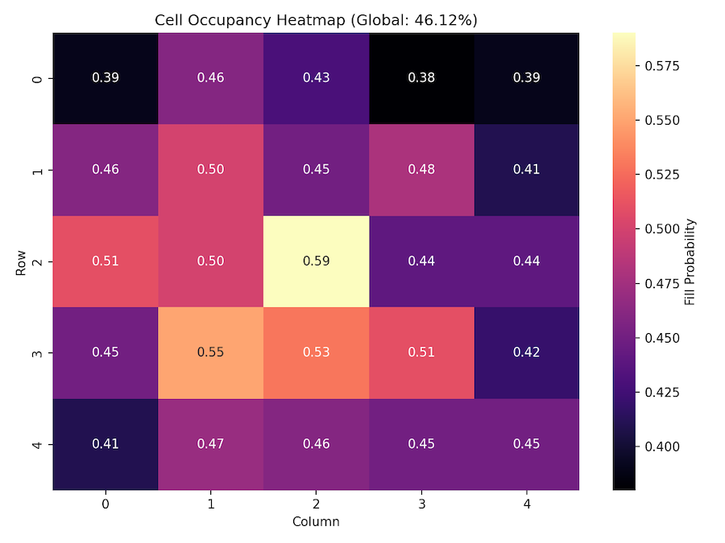
    </td>
  </tr>
</table>

See more about [training](./docs/training.md)

## Kinetic resolution solver

Once trained, the energy function enables solution finding through gradient based optimization:

1. **Initialization**: Start from random or CNN predicted state
2. **Gradient descent**: Follow negative energy gradient
3. **Noise injection**: Stochastic term helps escape local minima
4. **Constraint enforcement**: Clamp values to valid range
5. **Convergence**: Stop when energy stabilizes

Solver parameters:
- Steps: 150 300
- Step size: 0.03
- Noise scale: 0.1 with decay
- Clamping range: [-2, 2]

You can see the cliff and valleys of the gradient descent in 3D, see those [interactive](https://latent-energy.surge.sh/interactive_comparison_dashboard.html) graphs

Or the dashboard below
<br/>
<a href="https://latent-energy.surge.sh">
  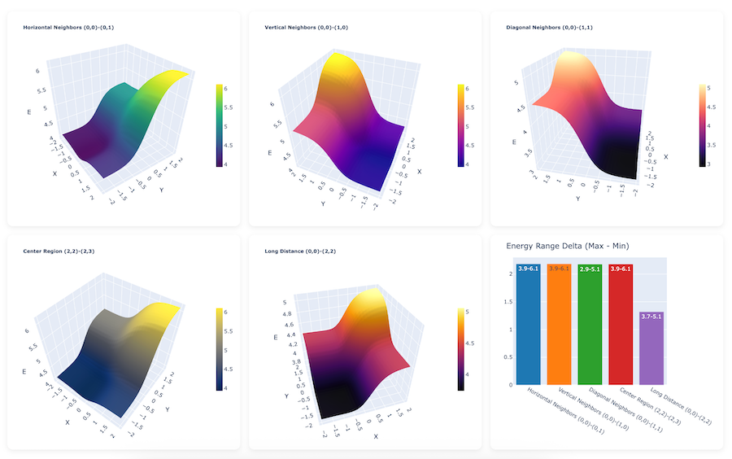
</a>


## Performance

The hybrid training approach achieves 100 percent accuracy on the validation set after 50 epochs. The kinetic solver converges to correct solutions in 150 300 steps, with inference times under 100 milliseconds per puzzle on GPU.

## Key insights

1. The convolutional architecture effectively captures local patterns in the grid configurations
2. Explicit logic constraints in the energy function help guide the optimization
3. Contrastive learning with margin provides clear separation between good and bad states
4. The kinetic solver's noise injection is crucial for escaping local minima

## Usage

```bash
Install just if not available
cargo install just

Set up environment
just setup

Solve a puzzle
just resolve id="puzzle_0060"

Train the model
just train

Visualize energy landscapes
just viz-energy
```

## Library and Hardware

The codebase uses:
- PyTorch for neural network implementation
- UV for Python package management
- Ruff and Pyright for linting and types
- Just for short-hand UV commands
- Unit test suites targetting 90+ percent coverage

All training and inference supports GPU acceleration through CUDA, MPS, or CPU fallback.
```