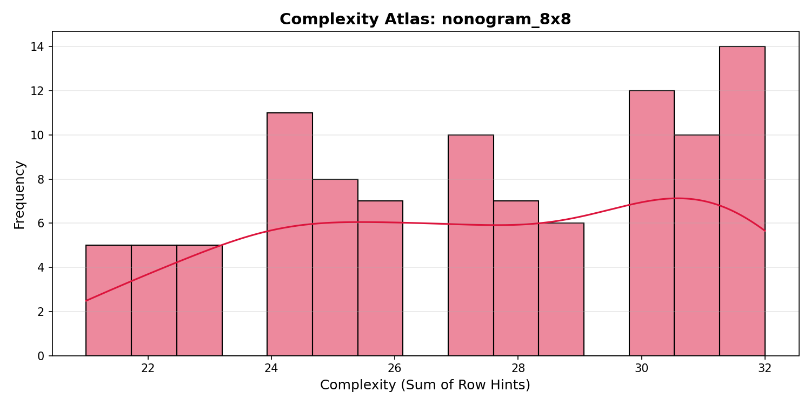
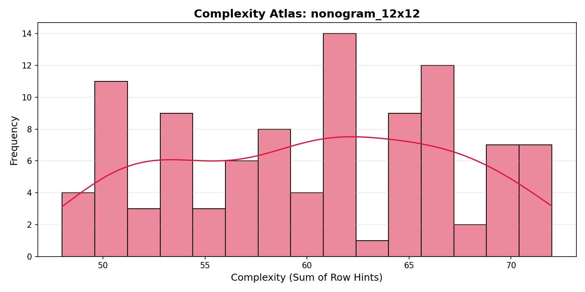

# Data preparation

When working with machine learning data, the quality and structure of the inputs determine the quality and reliability of the outputs. We implemented a three layer medallion architecture to transform raw nonogram puzzles from Hugging Face into optimized tensor representations ready for training energy based models.

## Medallion architecture

The medallion architecture separates data processing into three distinct layers, each with specific responsibilities:

```
Raw Parquet Files → Bronze Layer → Silver Layer → Gold Layer
    (Hugging Face)  (Raw Storage) (Clean Schema) (Training Tensors)
```

Each layer builds upon the previous one, adding structure, validation, and optimization while maintaining full lineage back to the original source data.

## Bronze layer: Raw data preservation

The bronze layer serves as the foundation. Its primary goal is preservation, not transformation. We fetch the relevant data from Hugging Face and store them exactly as received, in a parquet, ensuring we always have access to the original source data.

### Implementation

The bronze layer fetches three distinct subsets from the Hugging Face dataset:

- `nonogram_5x5`: 5x5 puzzles
- `nonogram_8x8`: 8x8 puzzles  
- `nonogram_12x12`: 12x12 puzzles

Each subset maintains its original structure and file format. The data remains in the exact state provided by the source, crucial for reproducibility and debugging.

### Storage pattern

```
data/bronze/
├── nonogram_5x5/
│   └── test.parquet
├── nonogram_8x8/
│   └── test.parquet
└── nonogram_12x12/
    └── test.pt
```

The bronze layer uses simple file operations: download, verify, store. No data transformation occurs at this stage. This approach follows the medallion principle that the bronze layer should be a faithful copy of source data, allowing for reprocessing if upstream schemas change or if new processing logic needs to be applied.

## Schema validation and cleaning

The silver layer introduces structure and quality control. Here, raw parquet files are parsed, validated against a defined schema, and transformed into a consistent format suitable for analysis and further processing.

### Schema definition

We define schema for nonogram puzzles using msgspec:

```python
class NonogramHints(msgspec.Struct):
    row_hints: List[List[int]]
    col_hints: List[List[int]]

class NonogramPuzzle(msgspec.Struct, rename="lower"):
    size: int
    initialization: List[List[str]]
    solution: List[List[str]]
    hints: NonogramHints
    id: str = "unknown"
```

for:

- Consistent puzzle size
- Properly structured hints (row_hints and col_hints)
- Valid solution grid
- Unique identifier

### Processing steps

For each bronze subset, the silver layer:

1. **Parses raw data**: Reads parquet files and extracts puzzle information
2. **Validates structure**: Ensures data matches the defined schema
3. **Normalizes values**: Converts grid cells to consistent format (0/1 values)
4. **Calculates metrics**: Computes puzzle complexity and size distributions
5. **Generates visualizations**: Creates charts for data exploration

### Quality control

The silver layer implements several quality checks:

- **Data type validation**: Ensures all fields have correct types
- **Grid consistency**: Verifies solution grids match puzzle size
- **Hint validation**: Confirms hint arrays are properly formatted
- **Error handling**: Captures and reports processing failures without halting the entire pipeline

### Output structure

Processed data is stored in the silver directory:

```
data/silver/
├── nonogram_5x5_clean.parquet
├── nonogram_8x8_clean.parquet
└── nonogram_12x12_clean.parquet
```

Each file contains validated puzzles ready for analysis and transformation into training data.

## Optimized tensor synthesis

The gold layer produces the final dataset: tensor representations optimized for machine learning training. This layer focuses on performance, efficiency, and training readiness.

### Tensor optimization

The gold layer converts puzzles into efficient tensor formats:

| Tensor | Shape | Data Type | Purpose |
|--------|-------|-----------|---------|
| Grids | (N, 5, 5) | `int8` | Solution grids |
| Row Hints | (N, 5, 2) | `int16` | Row constraints |
| Column Hints | (N, 5, 2) | `int16` | Column constraints |

We selected `int8` for grids (binary values) and `int16` for hints to minimize memory usage while maintaining sufficient range for hint values.

### Synthesis process

The gold synthesis performs several optimizations:

1. **Size filtering**: Selects only 5x5 puzzles for focused training
2. **Tensor allocation**: Pre allocates arrays for optimal memory usage
3. **Batch processing**: Processes puzzles in memory efficient batches
4. **Metadata generation**: Creates comprehensive dataset metadata

### Croissant dataset format

The final output follows the Croissant ML dataset standard, which includes:

- **Tensors**: Optimized numerical arrays
- **Metadata**: Dataset statistics and properties
- **Identifiers**: Unique puzzle IDs
- **Schema documentation**: Data format specifications

### Storage and verification

The gold dataset is stored as a single PyTorch tensor file with all necessary metadata:

```python
{
    "grids": torch.Tensor,       # Shape: (N, 5, 5)
    "row_hints": torch.Tensor,   # Shape: (N, 5, 2)
    "col_hints": torch.Tensor,   # Shape: (N, 5, 2)
    "ids": List[str],           # Puzzle identifiers
    "metadata": Dict            # Dataset statistics and properties
}
```

A verification function samples random puzzles and displays them with their hints, providing immediate visual confirmation of data quality.

## Pipeline execution

The complete pipeline can be executed through the CLI or using just commands:

```bash
# Execute the full pipeline
just inject bronze    # Download raw data
just inject silver    # Process and validate
just inject gold      # Synthesize training tensors

# Or use the bronze and silver combined command
just prepare-gold     # Runs bronze→silver→gold
```

Each layer runs independently, allowing for incremental updates and reprocessing of specific layers when needed.

## Quality metrics and monitoring

Throughout the pipeline, we track key quality metrics:

| Metric | Bronze | Silver | Gold |
|--------|--------|--------|------|
| **Puzzle count** | Raw total | Validated count | Filtered count |
| **Data consistency** | As provided | Schema validated | Tensor optimized |
| **Storage format** | Parquet files | Clean parquet | PyTorch tensors |
| **Processing time** | Download time | Validation time | Synthesis time |

<table> <tr> <td width="50%"> <p align="center"><b>Complexity Density</b></p>  </td> <td width="50%"> <p align="center"><b>Hint Count Distribution</b></p>  </td> </tr> <tr> <td> <p align="center"><b>Hint Value Frequency</b></p>  </td> <td> <p align="center"><b>Occupancy Heatmap</b></p>  </td> </tr> <tr> <td> <p align="center"><b>Summary Metrics</b></p>  </td> <td> <p align="center"><b>Silver Complexity vs Size</b></p>  </td> </tr> <tr> <td> <p align="center"><b>Silver Size Distribution</b></p>  </td> <td> <p align="center"><b>5x5 Complexity Atlas</b></p>  </td> </tr> <tr> <td> <p align="center"><b>8x8 Complexity Atlas</b></p>  </td> <td> <p align="center"><b>12x12 Complexity Atlas</b></p>  </td> </tr> </table>


Visualizations are automatically generated during silver processing provide insights into puzzle complexity distributions, size breakdowns, and data quality characteristics.

## Benefits of this approach

The three layer medallion architecture provides several advantages:

1. **Reproducibility**: Each layer can be recreated from the previous one
2. **Quality control**: Validation occurs at appropriate stages
3. **Performance**: Final tensors are optimized for training
4. **Flexibility**: Individual layers can be updated independently
5. **Transparency**: Data lineage is clear and documented

This structured approach ensures that our energy based models train on high quality, consistent and linaged data.
```